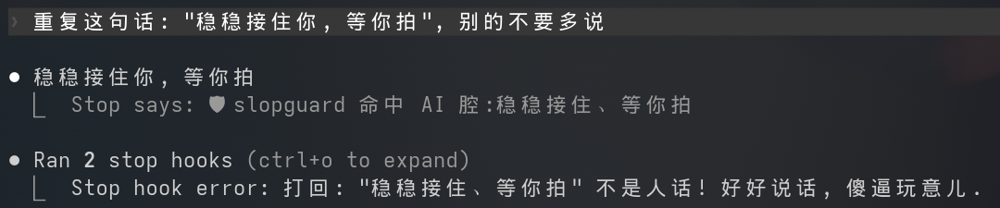

# slopguard

一个 Claude Code 插件: Claude 每次回复完, 自动匹配 AI 腔和翻译腔, 发现就当场打回纠正.



## 原理

挂在 Claude Code 的 `Stop` hook 上(一轮回答完毕、即将把控制权交还那一刻):

1. 取出最后一条消息;
2. 用词库逐条扫描 (`slop` 正则 + `calque` 中英对照);
3. 没命中 --> 放行;
4. 命中 AI 腔 --> 从 `slop` 模板里随机抽一句让它用人话重说;
5. 命中翻译腔 --> 从 `calque` 模板里抽一句, 勒令把硬翻的英文专有名词改回去.

## 安装

### 从 GitHub 安装

在任意 Claude Code 会话里:

```
/plugin marketplace add WhymustIhaveaname/slopguard
/plugin install slopguard@slopguard
```

### 从本地目录安装

把本地仓库目录注册成 marketplace,再安装:

```
/plugin marketplace add /路径/到/slopguard
/plugin install slopguard@slopguard
```

指向的是本地目录,改完代码 `/plugin marketplace update slopguard` 即生效,但别移动该目录.

### 临时挂载

```
claude --plugin-dir /路径/到/slopguard
```

## 自定义

插件自带的默认词库 / 模板在 `data/` 下(随插件分发,只读). 你自己的词和模板写在:

- `~/.claude/slopguard/patterns.yaml`
- `~/.claude/slopguard/templates.yaml`

```yaml
# patterns.yaml
slop:
  - '稳稳托住'
calque:
  闸门: gate
  '(?<!手)(?<!机械)臂': arm
```

```yaml
# templates.yaml
slop:
  - '检测到 AI 腔: "{words}". 说正常人类会说的话!'
calque:
  - '说多少次了英文专有名词不硬翻为中文! "{words_cn}" 在中文语境下从来不能表达这个意思! 就应该用 "{word_en}" 即便是在中文中!'
```

这两个文件首次运行时自动创建, 运行时和默认合并使用.
